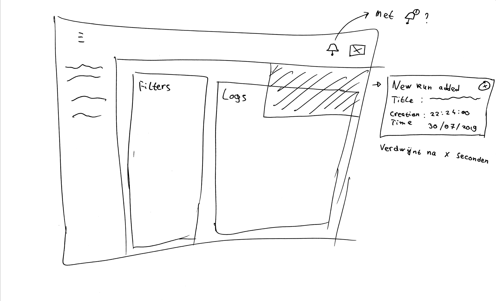

# Jiskefet Notifications
[](https://jiskefet-notifications.herokuapp.com/)

This project is a proof of concept with working notifications for the Jiskefet bookkeeping system. Check the demo [here](https://jiskefet-notifications.herokuapp.com/).

## Table of contents
* [Concept](#concept)
* [Installation](#installation)
* [Usage](#usage)

## Concept
The idea was to create a notification system form the [Jiskefet bookkeeping system](https://github.com/SoftwareForScience/jiskefet-ui).

<details>
  <summary>User story (in Dutch)</summary>

  ALS Gebruiker WIL IK live op de hoogte gehouden worden van FLP informatie (counters) ZODAT Ik deze informatie kan gebruiken zonder de webapplicatie te moeten refreshen.
</details>

So the task was to create a nice UX for notifications, which have to be implemented using WebSockets to receive them in real-time.

### Sketches
I made a few sketches to visualize my idea. Forgive me for the super basic sketches.

---

Notice the new notification bell icon.


A notification card will slide in if the WebSocket receives a new notification. If a doesn't manually close the notification, a notification count will appear on top of the notification bell to remind them that they might not have seen the notification.


If the user clicks the bell icon, the notification area will slide out and the user can scroll through their notifications. It's possible to delete them one by one, or delete all notifications at once.

### localStorage
I've also added the user of localStorage to save the current notifications between page reloads.

## Design decisions
I chose to go with a traditional slide out widget area because one of the requirements was that a user wouldn't need to permanently give up screen real estate for notifications.

I also chose to show a notification count icon only when a user hasn't interacted with the notification to reduce visual load.
Still, all notifications will be visible in the notification area until the user removes them from there. This prevents removing a notification by accident if you initially close them on receiving.

## Installation
Enter the following commands in your terminal:
```sh
git clone https://github.com/jeroentvb/project-3-1819.git
cd project-3-1819
npm install
```

## Usage
Run the server
```sh
npm start
# Or
nodemon
```

Navigate to [localhost:3000](localhost:3000), and you should see the jiskefet dashboard. It's also the only page that works.

If you navigate to [localhost:3000/triggers](localhost:3000/triggers) in a seperate tab you see a few buttons.

<details>
  <summary>Notification trigger buttons</summary>

  
</details>

These buttons trigger a notification in real time.
